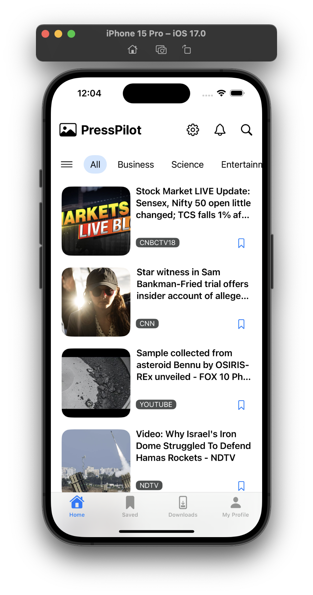

<!-- Copyright 2023 Md. Mahinur Rahman-->
<!---->
<!-- Licensed under the Apache License, Version 2.0 (the "License");-->
<!-- you may not use this file except in compliance with the License.-->
<!-- You may obtain a copy of the License at-->
<!---->
<!--     http://www.apache.org/licenses/LICENSE-2.0-->
<!---->
<!-- Unless required by applicable law or agreed to in writing, software-->
<!-- distributed under the License is distributed on an "AS IS" BASIS,-->
<!-- WITHOUT WARRANTIES OR CONDITIONS OF ANY KIND, either express or implied.-->
<!-- See the License for the specific language governing permissions and-->
<!-- limitations under the License.-->
 

<h1>PressPilot</h1>
  PressPilot is an iOS app built with SwiftUI that uses API to fetch and display 
  the news from all over the world. 
  When the user taps on a headline, they are navigated to a web view page of that news link.

<h3>Graphical User Interface</h3>
  <table style="border:none">
    <tr>
        <td></td>
        <td></td>
        <td></td>
     </tr>
  </table>
  
  <h3>Requirements</h3>
    <ol>
        <li>iOS 16.0 or later</li>
        <li>Xcode 12.0 or later</li>
        <li>Swift 5.3 or later</li>
    </ol>

<h3>Getting Started</h3>
  To clone this app and run it on Xcode, follow these steps:

<ol>
    <li>Clone the repository: git clone https://github.com/MahinMuhammad/PressPilot</li>
    <li>Open the PressPilot.xcodeproj file in Xcode.</li>
    <li>Build and run the project in Xcode.</li>
</ol> 
  
<h3>Features</h3>

<ul>
    <li>Displays news from all over the world.</li>
    <li>Lets user save news on cloud for watch later.</li>
    <li>Filter news list by category such as health, sience, business and so on.</li>
    <li>Filter news list for specific country or language (ability to change language or country comes with signup).</li>
    <li>Search news with keyword</li>
    <li>Allows user to signin or signup using firebase Auth.</li>
    <li>Stores user data using Firestore.</li>
    <li>Displays news based on specific language or country (after signup only)</li>
    <li>Toggle dark mode option in app settings.</li>
    <li>Navigates the user to the web view page of a news link when tapped on a headline</li>
</ul>   
  
<h3>Future Updates</h3>
  In the next update, I plan to have the following:
<ul>
    <li>Lets user download news on device for watch later offline.</li>
    <li>Share news over social media.</li>
    <li>Hide news or stop receiving news from perticular source.</li>
    <li>Allow or disallow push notification in app settings.</li>
</ul> 
    
<h3>Contributing</h3>
  I welcome contributions from the community! To contribute to TechEveryday, follow these steps:

<ol>
    <li>Fork the repository.</li>
    <li>Create a new branch for your feature: git checkout -b feature/your-feature-name.</li>
    <li>Make your changes and commit them: git commit -m "Add your commit message here".</li>
    <li>Push your changes to your forked repository: git push origin feature/your-feature-name.</li>
    <li>Submit a pull request to the main repository.</li>
</ol>
  
<h3>License</h3>
  This project is licensed under the Apache License 2.0 - see the LICENSE file for details.

<h3>Contact</h3>
  If you have any questions or comments about ChatGenie, feel free to reach out to me at rahmanmahin@icloud.com.

<table style="border:none">
  <tr>  
    <td align="center"></h4></td>
  </tr>
  <tr>  
    <td align="center"><h4>Developed by   Md. Mahinur Rahman</h4></td>
  </tr>
</table>
